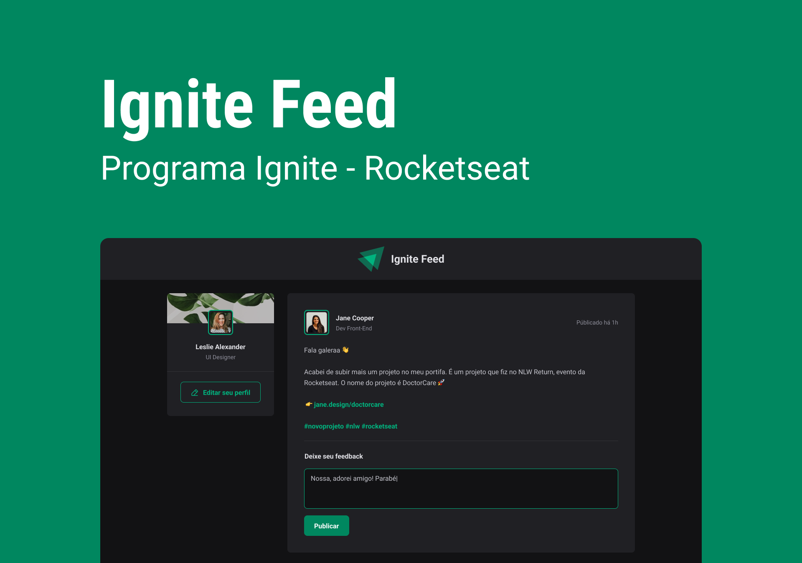

<h1 align="center">Ignite Feed</h1>

    Projeto pratico de treinamento by Ignite 💚

    <a href="#-tecnologias">Tecnologias</a>&nbsp;&nbsp;&nbsp;|&nbsp;&nbsp;&nbsp;
    <a href="#-projeto">Projeto</a>&nbsp;&nbsp;&nbsp;|&nbsp;&nbsp;&nbsp;
    <a href="#-layout">Layout</a>

 

    

## 🚀 Tecnologias

Esse projeto foi desenvolvido com as seguintes tecnologias:

- TypeScript
- ReactJS
- Vite
- HTML5
- CSS3

## 💻 Projeto

O Ignite Feed é um projeto simples que simula uma rede social onde é possível o usuário interagir e adicionar comentários com os posts criados.

Nesse projeto foi construído uma aplicação react utilizando typescript onde foi abordado conceitos como: 

- Componentes
- Propriedades
- Estado
- Imutabilidade
- React Hooks
- Como funciona o fluxo de renderização do React
- Como trabalhar com estilização dentro do React
- Fundamentos do TypeScript

## 📋 Layout 

Voce pode visualizar o layout do projeto através [DESSE LINK](https://www.figma.com/file/GrjZKvedvlHMEDzSxgWWEo/Ignite-Feed-(Community)). É necessário ter uma conta no [Figma](https://figma.com) para acessa-lo.

---

Feito com 💜 by Phelipe Pereira :wave:
